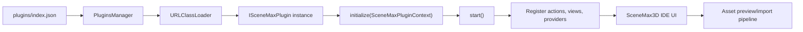

# Enhanced Plugin System

The enhanced plugin system lets SceneMax3D IDE plugins add first-class IDE functionality instead of only sending runtime commands. Enhanced plugins can add toolbar buttons, menu actions, dockable/editor views, asset browser panels, persisted settings, and project asset import flows.

The Meshy AI plugin is the current real-world reference implementation:

- Plugin entry point: [`MeshySceneMax3DPlugin.java`](../scenemax3d_plugins_ide/src/com/scenemaxeng/plugins/ide/meshy/MeshySceneMax3DPlugin.java)
- Main plugin UI: [`MeshyViewPanel.java`](../scenemax3d_plugins_ide/src/com/scenemaxeng/plugins/ide/meshy/MeshyViewPanel.java)
- HTTP/API integration: [`MeshyService.java`](../scenemax3d_plugins_ide/src/com/scenemaxeng/plugins/ide/meshy/MeshyService.java)
- Community model result adapter: [`MeshyCommunityModelItem.java`](../scenemax3d_plugins_ide/src/com/scenemaxeng/plugins/ide/meshy/MeshyCommunityModelItem.java)
- IDE host bridge: [`IdePluginHostContext.java`](../src/com/scenemax/desktop/plugins/IdePluginHostContext.java)

## Architecture

Enhanced plugins are Java classes loaded from plugin jars declared in [`plugins/index.json`](../plugins/index.json). At IDE startup, `MainApp` loads active plugins marked with `"enhanced": true`, creates a shared `IdePluginHostContext`, calls `initialize(context)`, then calls `start()`.



The core contracts live in [`scenemax3d_common_types/src/com/scenemaxeng/common/types`](../scenemax3d_common_types/src/com/scenemaxeng/common/types):

- `ISceneMaxPlugin` - plugin lifecycle and manifest entry point.
- `PluginBase` - convenience base class that stores `context` and observer.
- `SceneMaxPluginManifest` - id, name, version, description, capabilities.
- `SceneMaxPluginContext` - host services exposed to enhanced plugins.
- `SceneMaxPluginAction` - menu and toolbar actions.
- `SceneMaxPluginView` - Swing view panels opened as IDE tabs.
- `SceneMaxAssetProvider` - asset browser/provider panels.
- `SceneMaxPluginImportResult` - result returned by direct model imports.

## Plugin Discovery

Plugins are listed in [`plugins/index.json`](../plugins/index.json). An enhanced IDE plugin entry looks like this:

```json
{
  "name": "meshy_ai",
  "fileName": "scenemax3d-internal-plugins-ide.jar",
  "className": "com.scenemaxeng.plugins.ide.meshy.MeshySceneMax3DPlugin",
  "active": true,
  "enhanced": true,
  "desc": "Adds Meshy AI model generation, task search, download and SceneMax asset import"
}
```

Fields:

- `name` is the loader key used by `PluginsManager.loadPlugin(...)`.
- `fileName` is the jar under the root `plugins/` folder.
- `className` must implement `ISceneMaxPlugin`.
- `active` controls whether the plugin can load.
- `enhanced` opts the plugin into IDE host services.
- `desc` is human-readable metadata.

## Lifecycle

Most enhanced plugins should extend `PluginBase`:

```java
public final class ExampleSceneMax3DPlugin extends PluginBase {
    @Override
    public SceneMaxPluginManifest getManifest() {
        return new SceneMaxPluginManifest(
                "example.plugin",
                "Example Plugin",
                "1.0.0",
                "Adds an example view and import action.",
                Arrays.asList("menu", "toolbar", "view", "asset-import"));
    }

    @Override
    public int start(Object... args) {
        context.registerView(new ExampleView());
        context.registerMenuAction("Assets", new OpenExampleAction());
        context.registerToolbarAction(new OpenExampleAction());
        return 0;
    }
}
```

`initialize(SceneMaxPluginContext)` is called before `start()`. If you extend `PluginBase`, the base implementation stores the context for later use.

Use `getManifest()` to describe capabilities. The host does not currently enforce capability strings, but they make plugin intent visible and are useful for future filtering and diagnostics.

## Host Context API

`SceneMaxPluginContext` is the main bridge from plugin code into the IDE:

```java
String getProjectPath();
String getResourcesFolder();
String getScriptsFolder();

String getSetting(String key, String defaultValue);
void setSetting(String key, String value);

void registerToolbarAction(SceneMaxPluginAction action);
void registerMenuAction(String menuPath, SceneMaxPluginAction action);
void registerView(SceneMaxPluginView view);
void registerAssetProvider(SceneMaxAssetProvider provider);

void openView(String viewId);
SceneMaxPluginImportResult importModelAsset(File modelFile, String requestedName, JSONObject metadata) throws IOException;
void previewModelAsset(File modelFile, String requestedName, JSONObject metadata) throws IOException;
void refreshProject();
void showStatus(String message);
```

### Project Paths

Use these methods instead of guessing folders:

- `getProjectPath()` returns the active project root.
- `getResourcesFolder()` returns the active project resources directory.
- `getScriptsFolder()` returns the active project scripts directory.

Plugins should gracefully handle missing project paths. A plugin view can open without an active project, but import actions require project resources.

### Settings

Use settings for user-specific plugin data such as API keys and preferences:

```java
String apiKey = context.getSetting("meshy_api_key", "");
context.setSetting("meshy_api_key", apiKeyField.getText().trim());
```

The Meshy plugin uses this for the Meshy API key in [`MeshyViewPanel.java`](../scenemax3d_plugins_ide/src/com/scenemaxeng/plugins/ide/meshy/MeshyViewPanel.java).

### Toolbar And Menu Actions

Actions implement `SceneMaxPluginAction`:

```java
SceneMaxPluginAction openAction = new SceneMaxPluginAction() {
    public String getId() { return "example.open"; }
    public String getLabel() { return "Example"; }
    public String getTooltip() { return "Open the example plugin"; }
    public void perform(SceneMaxPluginContext context) {
        context.openView("example.view");
    }
};

context.registerMenuAction("Assets", openAction);
context.registerToolbarAction(openAction);
```

The Meshy plugin registers one action into the `Assets` menu and toolbar. See [`MeshySceneMax3DPlugin.java`](../scenemax3d_plugins_ide/src/com/scenemaxeng/plugins/ide/meshy/MeshySceneMax3DPlugin.java).

### Views

Views implement `SceneMaxPluginView` and return a Swing component:

```java
context.registerView(new SceneMaxPluginView() {
    public String getId() { return "example.view"; }
    public String getTitle() { return "Example"; }
    public JComponent createComponent(SceneMaxPluginContext context) {
        return new ExamplePanel(context);
    }
});
```

The host opens plugin views as IDE tabs. Keep view ids stable. View components may be recreated, so store durable data in settings or project files rather than in a component instance.

### Asset Providers

Asset providers expose browser-like panels:

```java
context.registerAssetProvider(new SceneMaxAssetProvider() {
    public String getId() { return "example.assets"; }
    public String getDisplayName() { return "Example Assets"; }
    public JComponent createBrowserComponent(SceneMaxPluginContext context) {
        return new ExampleAssetBrowser(context);
    }
});
```

The Meshy plugin registers an asset provider using the same panel as its main view so users can browse, generate, preview, and import from one place.

## Model Import And Preview

Plugins can import a model directly or open the model import designer for preview.

Use direct import when the user has already accepted the asset:

```java
JSONObject metadata = new JSONObject();
metadata.put("provider", "example");
metadata.put("source", "community");
metadata.put("isStatic", false);

SceneMaxPluginImportResult result =
        context.importModelAsset(glbFile, "example_character", metadata);
```

Use preview import when the user should inspect scale, orientation, static/dynamic behavior, and bundled animations:

```java
context.previewModelAsset(glbFile, "example_character", metadata);
```

The host will:

- Stage the file using a parser-safe, unique model name.
- Open the model import designer.
- Normalize imported model files where possible.
- Register temporary model metadata for preview.
- Let the user accept or cancel the import.
- Refresh project assets after successful import.

The model import designer also lists bundled GLB/GLTF animations and can run them in the preview by issuing SceneMax commands such as:

```scenemax
model_1."walk"
```

## Naming Rules

SceneMax model resource names are used by the SceneMax parser, so plugin-provided names must be parser-safe.

Recommended rules:

- Use lowercase ASCII letters, digits, and underscores only.
- Replace spaces, hyphens, punctuation, and symbols with `_`.
- Do not start names with a digit.
- Keep names short, ideally 48 characters or less.
- Make names unique before opening the import designer.

Good:

```text
meshy_horse_girl_t_pose
model_1
community_robot_walk_2
```

Avoid:

```text
meshy_horse_girl_t-pose
Horse Girl T-Pose!
123_robot
```

`IdePluginHostContext` and `Import3DModelPanel` both enforce these rules defensively, but plugins should still provide clean names for clearer UI.

## Metadata

`importModelAsset(...)` and `previewModelAsset(...)` accept a `JSONObject metadata`. The host stores direct-import metadata under `pluginMetadata` in `models-ext.json`. Preview imports pass metadata into the import flow.

Common metadata fields:

```json
{
  "provider": "meshy.ai",
  "source": "community",
  "taskId": "018...",
  "resultId": "018...",
  "animationId": "018...",
  "hasAnimation": true,
  "hasRigHint": true,
  "isStatic": false,
  "pageUrl": "https://www.meshy.ai/3d-models/..."
}
```

Use metadata for traceability, not for required runtime behavior. Runtime-critical fields should be written to the actual SceneMax resource metadata.

## Threading And UI

Plugin views are Swing components. Follow normal Swing rules:

- Create and update Swing controls on the Event Dispatch Thread.
- Run network calls, downloads, and long work in `SwingWorker` or a background thread.
- Publish progress through Swing-safe callbacks.
- Avoid blocking `perform(...)`; open a view or start background work instead.

The Meshy panel uses `SwingWorker` for API calls and downloads, and publishes download progress into a progress bar.

## Error Handling

Plugins should convert technical failures into actionable user messages. Recommended patterns:

- Validate API keys before starting remote calls.
- Validate file existence before import.
- Show network errors with the remote status body where possible.
- Keep import names safe and unique to avoid parser errors.
- Fall back when a remote provider has optional features. For example, Meshy animated community downloads fall back to ordinary GLB downloads if Meshy rejects animation packaging for a specific community model.

## Build And Packaging

The internal IDE plugin jar is built by the Gradle module `scenemax3d_plugins_ide`.

Useful commands:

```powershell
.\gradlew.bat :scenemax3d_plugins_ide:build --no-daemon
.\gradlew.bat :scenemax3d_plugins_ide:build compileJava --no-daemon
```

The build produces the plugin jar and copies it to the root `plugins/` folder through the module's build tasks. Restart or reload the IDE after rebuilding plugin jars.

For external plugins, provide a jar containing your plugin class and dependencies, place it under `plugins/`, and add a matching entry to `plugins/index.json`.

## Minimal Enhanced Plugin

```java
package com.example.scenemax;

import com.scenemaxeng.common.types.PluginBase;
import com.scenemaxeng.common.types.SceneMaxPluginAction;
import com.scenemaxeng.common.types.SceneMaxPluginContext;
import com.scenemaxeng.common.types.SceneMaxPluginManifest;
import com.scenemaxeng.common.types.SceneMaxPluginView;

import javax.swing.JLabel;
import javax.swing.JPanel;
import java.util.Arrays;

public final class ExamplePlugin extends PluginBase {
    private static final String VIEW_ID = "example.plugin.view";

    @Override
    public SceneMaxPluginManifest getManifest() {
        return new SceneMaxPluginManifest(
                "example.plugin",
                "Example Plugin",
                "1.0.0",
                "Demonstrates enhanced SceneMax3D plugin APIs.",
                Arrays.asList("menu", "toolbar", "view"));
    }

    @Override
    public int start(Object... args) {
        context.registerView(new SceneMaxPluginView() {
            public String getId() { return VIEW_ID; }
            public String getTitle() { return "Example Plugin"; }
            public javax.swing.JComponent createComponent(SceneMaxPluginContext context) {
                JPanel panel = new JPanel();
                panel.add(new JLabel("Hello from an enhanced plugin"));
                return panel;
            }
        });

        SceneMaxPluginAction open = new SceneMaxPluginAction() {
            public String getId() { return "example.open"; }
            public String getLabel() { return "Example"; }
            public String getTooltip() { return "Open the example plugin"; }
            public void perform(SceneMaxPluginContext context) {
                context.openView(VIEW_ID);
            }
        };

        context.registerMenuAction("Tools", open);
        context.registerToolbarAction(open);
        return 0;
    }
}
```

`plugins/index.json`:

```json
{
  "name": "example_plugin",
  "fileName": "example-plugin.jar",
  "className": "com.example.scenemax.ExamplePlugin",
  "active": true,
  "enhanced": true,
  "desc": "Example enhanced plugin"
}
```

## Meshy As A Reference

The Meshy plugin demonstrates most enhanced plugin capabilities:

- Manifest and capabilities in `MeshySceneMax3DPlugin`.
- Toolbar and menu action registration.
- A full Swing view with forms, task lists, community search, thumbnail loading, progress, and import buttons.
- Persisted plugin setting for the Meshy API key.
- Remote API calls and downloads in `MeshyService`.
- Direct import and preview import with metadata.
- Static environment model option passed into the model import designer.
- Community model filtering, including best-effort rig/animation hints.
- Safe import naming and model preview workflow.

Start with [`docs/meshy-ai-plugin.md`](meshy-ai-plugin.md) when you want a feature-level walkthrough of that implementation.
